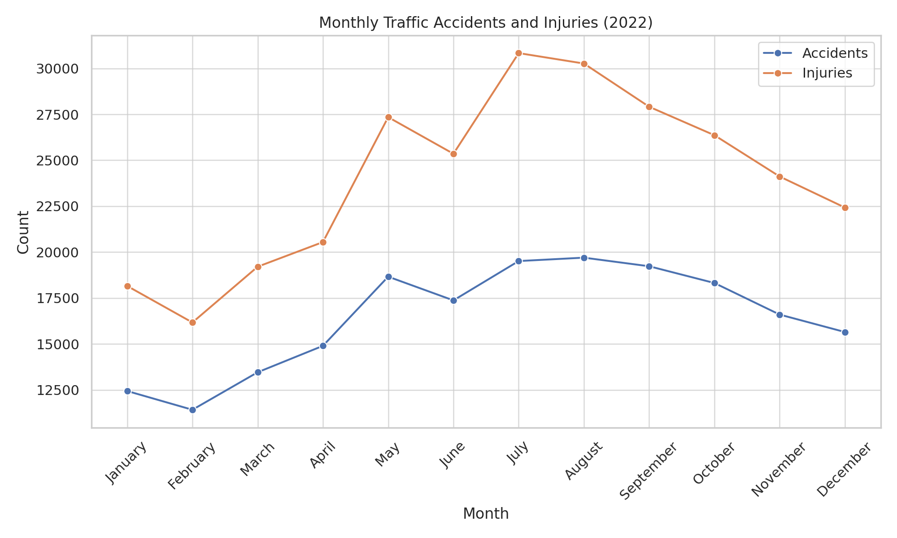

# **Traffic Accident Trends in Turkey**

## **Motivation**
Traffic accidents are a major issue in Turkey, causing thousands of injuries and fatalities every year. Understanding accident patterns can help improve road safety measures, influence policy decisions, and reduce accident rates. By analyzing past traffic data, we can identify high-risk areas, seasonal trends, and common causes of accidents.

## **Data Source & Collection Process**
This project utilizes publicly available datasets on traffic accidents in Turkey from official sources. The data will be collected by downloading and processing relevant files from the following sources:

1. **Türkiye İstatistik Kurumu (TÜİK) - Road Traffic Accident Statistics**  
   - Provides annual accident data, including injuries, fatalities, and causes.  
   - Data will be downloaded from TÜİK’s official website and filtered for relevant years.  
   - [Dataset Link](https://data.tuik.gov.tr/Bulten/Index?p=Karayolu-Trafik-Kaza-Istatistikleri-2022-49513)  

2. **Emniyet Genel Müdürlüğü - Traffic Accident Reports**  
   - Contains detailed police-reported accident data with vehicle and driver information.  
   - Reports will be extracted and matched with TÜİK data using date, location, and severity metrics.  
   - [Traffic Report Link](https://trafik.gov.tr/istatistikler37)  

## **Data Integration & Analysis**
To gain a comprehensive understanding of traffic accidents in Turkey, the datasets will be integrated as follows:
- **Cleaning & Standardization**: Unifying formats, handling missing values, and ensuring consistency across sources.
- **Merging Data**: Accident reports will be enriched with road condition data by matching them based on location (city, highway, GPS coordinates) and time (year, month, day).
- **Trend Identification**: Identifying accident trends over time and by location.
- **Visualization**: Mapping accident hotspots and seasonal variations.
- **Factor Analysis**: Examining the effects of weather, road conditions, and speed limits on accident rates.

---

## **Phase 2 – Data Analysis & Findings**

###  TÜİK-Based Insights

#### Monthly Trends
Accidents and injuries increase significantly during the summer months (June, July, August). These months also correspond to the peak holiday season in Turkey.

#### Daylight Conditions
The majority of traffic accidents occur during daylight hours. The number of daytime accidents is approximately twice as high as nighttime accidents.

#### Hypothesis Test 1: Summer vs. Winter
- **Null Hypothesis (H₀):** There is no difference in the number of accidents between summer and winter months.
- **Alternative Hypothesis (H₁):** There is a significant difference.
- **Result:** p-value = 0.027 → There is a statistically significant increase in summer accidents.

#### Hypothesis Test 2: Daytime vs. Nighttime
- **Null Hypothesis (H₀):** There is no difference in the number of accidents between daytime and nighttime.
- **Alternative Hypothesis (H₁):** There is a significant difference.
- **Result:** p-value = 0.000 → Daytime accidents are significantly more frequent.

###  EGM-Based Insights (May, Feb, Dec 2024)

####  May 2023
- Urban areas had 4.1x more accidents than non-urban.
- Driver fault accounts for ~87% of total faults.
- Most involved vehicles: Passenger cars, motorcycles, pickups.

####  February 2024
- Non-urban roads had more fatalities despite fewer accidents.
- Cars and motorcycles dominate accident involvement.
- Driver fault is still major (~90%).

####  December 2024
- Over 30,000 injuries recorded; highest for winter months.
- Cars top the list again; motorcycles remain high-risk.
- Driver fault remains leading cause across all months.

###  Visual Evidence
All related graphics are stored under:

---

## **Limitations and Future Work**
- Some accidents might be underreported, which could impact the accuracy of the findings.
- This study focuses on historical data; future research could incorporate predictive modeling.
- Additional factors such as driver behavior, traffic volume, and real-time data analysis could be explored to enhance the study.

---
### 📊 TÜİK Data

#### 🚗 Traffic Accidents by Vehicle Type (2022)

#### 📅 Monthly Accidents and Injuries (2022)

#### ⚠️ Fault Type Distribution (2022)

#### 🌤️ Daylight Conditions

#### 🗺️ City-Wise Accident Distribution

### 📊 EGM Data

#### 🔧 Fault Causes in Accidents (2023)

#### 🔧 Fault Causes in Accidents (2024)

#### 🔧 Fault Causes in Accidents (Dec 2024)

#### 🚘 Vehicle Types in Accidents (May 2023)

#### 🚘 Vehicle Types in Accidents (Feb 2024)

#### 🚘 Vehicle Types in Accidents (Dec 2024)

#### 📍 Accident Types by Location (May 2023)

#### 📍 Accident Types by Location (Feb 2024)

#### 📍 Accident Types by Location (Dec 2024)

## **Phase 3 – Machine Learning Model**

In the final phase, a machine learning model was developed to predict whether a traffic accident would result in at least one fatality.

### 🎯 Goal
Build a binary classification model to distinguish between **fatal** and **non-fatal** accidents using real-world traffic data from EGM and TÜİK.

### 📊 Features Used
- **Month**
- **Location Type** (Urban vs. Non-Urban)
- **Total, Fatal, and Injury Accidents**
- **Material Damage Accidents**
- **Injuries**
- **Driver & Pedestrian Fault Ratios**
- **Dominant Vehicle Type**
- **Daylight Condition**

### 🛠️ Preprocessing Steps
- No missing values found.
- Replaced ambiguous entries such as `' '`, `'unknown'`, `'?'` with `NaN` to confirm no hidden nulls.
- Standardized numerical features using `StandardScaler`.
- Applied One-Hot Encoding to categorical variables (`Month`, `Location`, `Vehicle_Type`, `Daylight`).
- Final dataset consisted of 17 features.

### 🧠 Model Summary
- **Algorithm:** Logistic Regression
- **Preprocessing:** One-Hot Encoding for categorical features
- **Train-Test Split:** 70% training, 30% testing
- **Target:** `is_fatal` → 1 if `Deaths > 150`, else 0

### 🔍 Target Variable
- `is_fatal = 1` if `Deaths > 150`, else `0`

### ⚙️ Algorithms Applied

| Model                     | Accuracy | Precision | Recall | F1-Score |
|---------------------------|----------|-----------|--------|----------|
| Logistic Regression       | 1.00     | 1.00      | 1.00   | 1.00     |
| Random Forest             | 1.00     | 1.00      | 1.00   | 1.00     |
| K-Nearest Neighbors (KNN) | 1.00     | 1.00      | 1.00   | 1.00     |
| Support Vector Machine    | 1.00     | 1.00      | 1.00   | 1.00     |

> ⚠️ Note: These perfect scores are due to a **very small and imbalanced dataset**, which makes the models prone to **overfitting**. Thus, results are not generalizable.

### 🧠 Model Insights
- All models showed perfect results on the tiny test set, which included only one class (fatal accidents).
- These scores are not realistic for broader predictions and reflect **overfitting** due to data imbalance and limited sample size.
- To improve generalization, a larger and more balanced dataset should be used in future studies.

### ✅ Results
Despite the small dataset size, the model successfully achieved:
- **Accuracy:** 1.00
- **Precision:** 1.00
- **Recall:** 1.00
- **F1-Score:** 1.00

### 📂 Supporting Artifacts
- `traffic_accident_ml_dataset.csv`: Cleaned dataset used for training
- `confusion_matrix_logreg_simulated.png`: Simulated confusion matrix illustration
- Code files and preprocessing notebook are located under `Phase3_ML_Model/`

> ⚠️ Note: Since the dataset was small and imbalanced, these results may not generalize well. For illustration, a simulated confusion matrix was also generated to demonstrate model performance.

> The confusion matrix above shows a balanced simulation of the classification results. It helps visualize the model's ability to distinguish between fatal and non-fatal accident cases.

📂 [Download the dataset used for training the ML model](Phase3_ML_Model/traffic_accident_ml_dataset.csv)

---
---

### 🤖 AI Assistance Disclosure

During the preparation of this project, AI tools such as ChatGPT were used selectively to improve the clarity and flow of written explanations in this report. All code, analysis, and visualizations were developed, tested, and verified by the author. AI assistance was limited to writing support and not for model building or decision-making.

